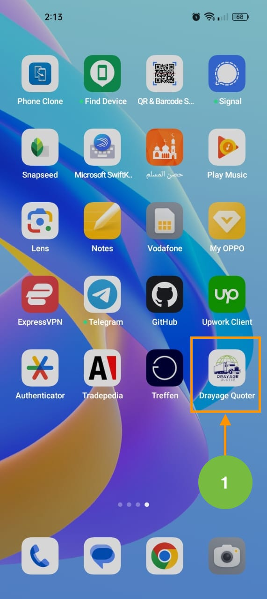

# Sign Up

---
User can create a new account to start using the Drayage Quoter app and it's features.

## How to sign up in the Drayage Quoter app?

Follow these simple steps to create an new account in the Drayage Quoter app.

1. Download & Install the **Drayage Quoter App** from the 📱 mobile store:
      - [Google Play](https://play.google.com/store/apps/details?id=com.truckingservice.dryage_quoter&pli=1).
      - [Apple Store](https://apps.apple.com/us/app/drayage-quoter/id1645693744).
2. Open the Drayage Quoter app to start creating a new account.

3. Now, you can sign up by enter the your email and password.
.

4. After adding your email and password, click on the "**Register**" to navigate to the home screen of the app.
